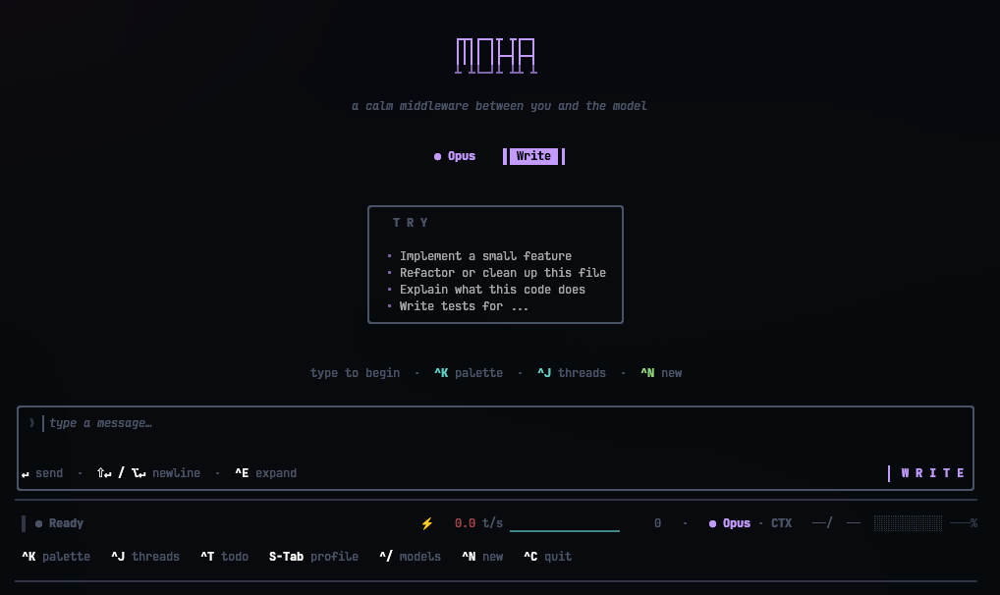

# moha

A native terminal client for Claude — written in modern C++26, rendered on a custom TUI engine, no Electron / Node / Python runtime in the loop.

<p align="center">
  
</p>

```
moha = the model + maya (the renderer) + you
```

For people who'd rather have a single binary they can read end-to-end than a 200 MB Electron app — and who care about being able to audit every code path that handles their credentials, their filesystem, and their tool calls.

## Install

### One-liner (Linux & macOS)

```bash
curl -fsSL https://raw.githubusercontent.com/1ay1/moha/master/scripts/install.sh | sh
```

Detects your OS+arch, downloads the latest pre-built binary, verifies the SHA256, drops it in `~/.local/bin/moha`. Then run `moha`.

Pin a version with `MOHA_VERSION=v0.1.0`, change the install dir with `MOHA_PREFIX=/usr/local/bin`.

### Native installer (per platform)

Every release also ships a proper installer for each platform — pick the one that matches your OS and let your package manager / installer handle the rest.

| Platform | Installer | One-line install |
|---|---|---|
| **Debian / Ubuntu** (x86_64, ARM64) | `.deb` | `sudo apt install ./moha-<ver>-linux-<arch>.deb` |
| **Fedora / RHEL / openSUSE** (x86_64, ARM64) | `.rpm` | `sudo dnf install ./moha-<ver>-linux-<arch>.rpm` |
| **macOS** (Intel + Apple Silicon) | `.dmg` | mount, drag `moha` to `/Applications` (or `~/bin`) |
| **Windows** (x86_64) | `.exe` (NSIS) | double-click; installer offers to add `moha` to PATH |

All grabbed from the [Releases page](https://github.com/1ay1/moha/releases). `SHA256SUMS` is attached to every release for verification.

> **Code signing:** macOS and Windows installers are **not** signed yet. Gatekeeper will say "unidentified developer" (right-click → Open to bypass), and SmartScreen will say "Windows protected your PC" (More info → Run anyway). Signing is a separate, paid concern (Apple Dev ID, Authenticode cert) and tracked as a follow-up.

### Portable archive (no installer)

Prefer to drop the binary somewhere yourself? Grab the tarball / zip:

| Platform | Asset |
|---|---|
| Linux x86_64 | `moha-<ver>-linux-x86_64.tar.gz` |
| Linux ARM64 | `moha-<ver>-linux-arm64.tar.gz` |
| macOS Intel | `moha-<ver>-macos-x86_64.tar.gz` |
| macOS Apple Silicon | `moha-<ver>-macos-arm64.tar.gz` |
| Windows x86_64 | `moha-<ver>-windows-x86_64.zip` |

### Build from source

```bash
git clone --recursive git@github.com:1ay1/moha.git
cd moha
cmake -B build && cmake --build build
./build/moha
```

Build needs GCC 14+ or Clang 18+ (`std::expected`, `std::format`, designated init through templates) and CMake 3.28+. Auth happens in-app on first launch.

## What ships

- **Live streaming** with mid-stream input queuing — type while the model is answering, your message submits when it lands.
- **Threads on disk** under `~/.moha/`. Browse / fork / delete from `^J`.
- **Markdown** with syntax-highlighted code blocks in the assistant pane.
- **Tools**: `read`, `write`, `edit`, `bash`, `grep`, `glob`, `list_dir`, `find_definition`, `web_fetch`, `web_search`, `todo`, `diagnostics`, and the `git_*` family. Each tool gets a purpose-built widget — diffs render as diffs, search results group by file with line numbers, bash shows exit codes, todo lists become checklists.
- **Codebase intelligence tools**: `outline`, `repo_map`, `signatures`, `find_usages`, `navigate` — backed by an in-process symbol index with PageRank-flavoured centrality and a bidirectional cross-file reference graph. `navigate("where do we handle webhook delivery?")` returns ranked candidate files / symbols / modules in milliseconds, no grep, no sub-agent. Scales cleanly to 100k-file repos.
- **Sub-agent**: `investigate(query)` spawns an isolated 8-way parallel sub-agent over the read-only toolkit, streams its progress live, and returns one compact synthesis to the parent. The parent's context grows by ~500 tokens for "explain how X works" instead of 30k.
- **Permission profiles** — `Write` (autonomous), `Ask` (prompt before any Exec/WriteFs/Net call), `Minimal` (prompt for everything except Pure). Cycle with `S-Tab`. The trust matrix is a `constexpr` function with `static_assert`s proving every (Effect × Profile) cell — refactoring the policy fails the build, not a test that nobody ran.
- **Workspace boundary** — every filesystem tool refuses paths outside the directory you launched from. `--workspace <dir>` widens it; `--workspace /` disables the gate for users who explicitly want unrestricted access.
- **Bash sandbox** — `bash` and `diagnostics` calls run inside an OS-native sandbox: `bwrap` (bubblewrap) on Linux, `sandbox-exec` on macOS. Workspace + system libs + network are reachable; `/etc`, `/home/<other-projects>`, `~/.ssh`, `/opt`, `/usr` are read-only. So even an approved bash call can't `rm -rf ~` or `cat ~/.ssh/id_rsa`. Auto-detected at startup; `--sandbox on` requires it (fail loud if missing), `--sandbox off` opts out (e.g. you're already in Docker).
- **Auth, in-app**. First launch opens a modal with two paths: paste an API key (`sk-ant-…`), or run OAuth against your Claude Pro/Max subscription. Credentials live in `~/.config/moha/` with `0600` perms (POSIX) / restrictive ACLs (Windows). Env-var overrides (`ANTHROPIC_API_KEY`, `CLAUDE_CODE_OAUTH_TOKEN`) and `-k` flag still work.
- **Inline render mode** — moha lives at the bottom of your terminal, preserves scrollback, doesn't take over the screen.

## Persistent codebase memory

The defining feature. moha doesn't just *use* the model — it **accumulates a persistent, multi-layered understanding of your codebase** that travels with the workspace and gets cheaper to use the more you use it. Anthropic's prompt cache pays once per turn; everything cached beyond that turn is essentially free.

Five layers, each independent, each automatically maintained:

| Layer | What it knows | Where it lives | Refreshed by |
|---|---|---|---|
| **Symbol index** | Every function/class/struct/enum across C/C++ · Python · JS/TS · Go · Rust, with PageRank-style centrality | in-memory, lazy-built | mtime change |
| **Reference graph** | Bidirectional file ↔ symbol edges → "who uses Foo?" in microseconds | in-memory, same scan | mtime change |
| **File knowledge cards** | One-paragraph LLM-distilled "what does this file do?" per file, generated async by a Haiku worker | `.moha/cards/*.json` on disk | mtime change |
| **Memos** | Q-A pairs from past `investigate` runs + manual `remember` calls, with provenance + freshness scoring | `.moha/memos.json` on disk | git HEAD or file mtime |
| **ADRs** | Architectural decisions auto-mined from `git log` — every "switched from X to Y because…" commit becomes a memo | `.moha/memos.json` (`source: "adr"`) | new commits |

All five travel inside the **cached system prefix** of every request. Each turn pays the new-tokens cost (small) and reads the rest from the prompt cache (free). After a week of working on a codebase the system prompt is a *living document* the model never has to rebuild.

### Memory tools the agent can use

```
investigate(query)         spawn isolated sub-agent, save synthesis as a memo
remember(topic, content)   bank a fact you want to keep across sessions
forget(target)             drop a memo by id or topic substring
memos(filter?)             list every stored memo with confidence + freshness
recall(topic)              fetch the FULL text of a memo (bypasses prompt budget)
mine_adrs(since?)          walk git log, distill decisions into ADR memos
```

### Confidence + freshness scoring

Every memo carries provenance — model that wrote it (`opus`/`sonnet`/`haiku`), source (`auto`/`manual`/`adr`), base score. At render time we compute an effective confidence:

- **× model multiplier** (Opus 1.0 / Sonnet 0.85 / Haiku 0.7)
- **× 0.5** if any `file_refs` mtime moved past `created_at` (stale)
- **linear decay over 30 days** (floored at 30%)

The system prompt then renders memos by tier: `≥70%` full body, `40–69%` first paragraph + verify hint, `<40%` topic only with a `recall` hint. Stale knowledge gets out of the way; fresh knowledge gets the full real estate.

### Built for huge codebases

At 100k-file scale the file is the wrong unit — directories ARE. moha auto-detects modules and the system-prompt repo map shows a hierarchical overview:

```
[12847] src/runtime/         (28 files; top: Model, update, Cmd, view, subscribe)
[ 9233] include/moha/tool/   (14 files; top: ToolDef, ToolError, EffectSet)
[ 8104] src/io/              (6 files; top: Client, Request, HttpError, send)
[ 6920] include/moha/memory/ (5 files; top: MemoStore, FileCardStore, HotFiles)
```

`repo_map(path="src/runtime")` zooms into a subtree; `navigate(question)` does ranked semantic search over the symbol graph + memos + cards in pure C++ in milliseconds; `find_usages(symbol)` answers "what's the blast radius if I change this?" without `grep`.

Plus a `<recent-activity>` block in the system prompt that lists files touched in the last 60 min / 24 hr / 7 days (via `git log` + filesystem mtime), so the agent automatically focuses on what *you're* working on this week.

## Keys

```
Enter      send                   ^K     command palette
Alt+Enter  newline                ^J     thread list
Ctrl+E     expand composer        ^T     todo / plan
Esc        cancel / reject        ^/     model picker
S-Tab      cycle profile          ^N     new thread
                                  ^C     quit
```

## Architecture

```
                 ┌──────────────┐
  keystrokes ──> │   maya       │── ANSI ──▶ terminal
                 │   (TUI)      │
                 └──────┬───────┘
                        │ Element tree
                        ▼
                 ┌──────────────┐
                 │   moha       │── view(Model)
                 │   view/      │
                 ├──────────────┤
                 │   update/    │── (Msg, Model) -> (Model, Cmd)
                 ├──────────────┤
                 │   io/        │── HTTP/2, SSE, filesystem
                 └──────┬───────┘
                        │ JSON over HTTPS
                        ▼
                 ┌──────────────┐
                 │  Anthropic   │
                 └──────────────┘
```

Pure-functional update loop: `(Model, Msg) -> (Model, Cmd)`. The reducer is a single `std::visit` over a closed sum of every event the runtime can process. Strong ID newtypes (`ToolCallId`, `ThreadId`, `OAuthCode`, `PkceVerifier`) — swapping two arguments to `exchange_code(code, verifier, state)` is a compile error, not a debugging session.

Subprocess execution uses `posix_spawn` + `poll(2)` with in-process `SIGTERM → SIGKILL` deadlines on POSIX, and `CreateProcessW` with a separate reader thread on Windows — no dependency on GNU `timeout`, no `popen` quoting hazards. File writes are atomic (`write` + `fsync`/`_commit` + `rename`/`MoveFileExW(REPLACE_EXISTING|WRITE_THROUGH)`).

The renderer ([maya](https://github.com/1ay1/maya)) is a sister project — yoga-flavored flexbox with a typestate DSL, shipped as a header-mostly C++26 library. moha is what happens when you point it at a streaming chat model and give it tools.

## Runtime dependencies

The honest version of "no runtime dependencies." Default build:

- `libc` — glibc / musl on Linux, libSystem on macOS, MSVCRT on Windows. Always dynamic.
- `libssl` + `libcrypto` (OpenSSL), `libnghttp2`, `libstdc++`, `libgcc` — dynamic by default; must be present on the target machine.

Standalone build (`cmake -B build -DMOHA_STANDALONE=ON`):

- OpenSSL + nghttp2 statically linked when their `.a` archives are installed.
- `libstdc++` + `libgcc` folded in via `-static-libstdc++ -static-libgcc`.
- `libc` stays dynamic on Linux — fully-static glibc breaks the NSS resolver and `getaddrinfo`. Use `MOHA_FULLY_STATIC=ON` with a musl toolchain if you need a 100% static binary.
- macOS: `libSystem` stays dynamic (Apple ABI requires it). Third-party libs static.
- Windows: `MOHA_STANDALONE` implies `/MT` (static MSVCRT). Third-party libs from `x64-windows-static` vcpkg triplet.

So the accurate one-liner is: **statically linked except libc and (usually) OpenSSL.** No JIT, no script runtime, no headless browser, no garbage collector pause mid-stream.

## Status

Pre-1.0. Core loop, tools, streaming, permission profiles, in-app auth, persistence, picker overlays, and cross-platform subprocess all work and are built daily.

Honest about what's stubbed:

- **Checkpoint restore** — the `CheckpointId` type and the per-message marker exist; `RestoreCheckpoint` currently surfaces "not implemented yet" and does nothing. Coming.
- **Diff review pane** — the modal renders, but `pending_changes` is never populated by any tool today, so `Review changes` / `Accept all` / `Reject all` toast "no pending changes" rather than diffing your edits. Will land alongside checkpoint restore.

Cross-platform paths exist (`#ifdef _WIN32` branches throughout, `posix_spawn` for POSIX, `CreateProcessW` for Windows, `fdatasync`/`fsync` switched per OS), but only Linux gets daily smoke-testing. CI for macOS + Windows is next on the list — bug reports from those platforms welcome.

File terminal-rendering bugs with `$TERM`, your terminal emulator name, and a screenshot. Code-path bugs welcome too — paste the relevant block and `git rev-parse HEAD`.

## License

MIT.
