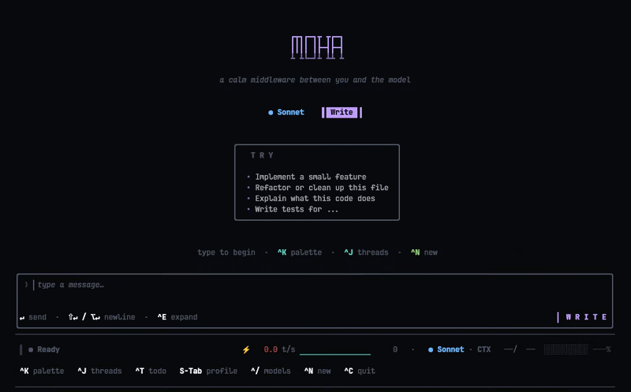

# moha

[](LICENSE)

<p align="center"><em>a calm middleware between you and the model</em></p>

A native terminal client for Claude. C++26, no Electron / Node / Python in the loop.

<p align="center">
  
</p>

> A C++26 alternative to `claude-code` focused on three things the official CLI doesn't try to do: a single 9 MB static binary instead of a Node runtime, sandbox-by-default for `bash` (bwrap/sandbox-exec), and a one-command SSH-tunneled airgap mode for hosts that can't reach the internet directly. Same OAuth and `ANTHROPIC_API_KEY` flows; you can switch between the two without re-authing.

- **One binary.** Statically linked except libc; spawns in milliseconds, no JIT warmup, no GC pauses mid-stream.
- **Read every line.** The reducer is one `std::visit` over a closed event sum. The permission trust matrix is a `constexpr` function with `static_assert`s — change a policy cell and the build breaks, not a test that nobody runs.
- **Sandboxed tools.** `bash` and `diagnostics` execute inside `bwrap` (Linux) / `sandbox-exec` (macOS). Workspace + system libs + network are reachable; `~/.ssh`, `/etc`, other projects are read-only. Even an approved bash call can't `cat ~/.ssh/id_rsa`.
- **Workspace boundary.** Filesystem tools refuse paths outside the directory you launched from. `--workspace /` opts out.
- **Inline render.** Lives at the bottom of your terminal, preserves scrollback, doesn't take over the screen.

## Install

```bash
git clone --recursive git@github.com:1ay1/moha.git
cd moha
cmake -B build && cmake --build build
./build/moha
```

GCC 14+ / Clang 18+, CMake 3.28+. Auth happens in-app on first launch.

## Getting started

```bash
cd path/to/your/project   # cwd is the workspace root
./build/moha              # or `moha` if it's on PATH
```

### Auth

First launch opens an auth modal with two paths:

- **API key.** Paste an Anthropic-issued `sk-ant-…` token. Saved to `~/.config/moha/credentials.json` (POSIX, `0600` perms) or `%USERPROFILE%\.config\moha\credentials.json` (Windows, restrictive ACL).
- **OAuth (Claude Pro/Max).** Opens your browser to the Anthropic consent screen; the callback returns a token stored in the same `credentials.json`. The file records which auth kind it holds, so on relaunch moha picks the right header automatically (`x-api-key:` vs `Authorization: Bearer`).

Override order, highest priority first — useful for ephemeral sessions, CI, or testing alternate accounts without touching the saved creds:

1. `-k <key>` / `--key <key>` — single-session API key, never written to disk.
2. `ANTHROPIC_API_KEY` env var — API-key flow.
3. `CLAUDE_CODE_OAUTH_TOKEN` env var — OAuth flow.
4. The on-disk `credentials.json` from the modal.

CLI subcommands cover the rest:

- `moha status` — prints the resolved auth state: which env vars are set, whether the on-disk creds are present, which one will actually be used.
- `moha login` — runs the auth flow non-interactively (useful for first-time setup over SSH or in scripts).
- `moha logout` — clears `credentials.json`. Next launch returns to the modal.
- `moha airgap user@host` — run moha on an air-gapped host through an SSH tunnel.  See [Air-gapped hosts](#air-gapped-hosts-ssh-tunnel) below.

Then you're in a thread. Type, hit `Enter`. The model has the full tool catalog (read/write/edit/bash/grep/git/web — see below); mid-stream typing queues your next message and lands it when the current turn finishes. `Esc` cancels a streaming response or rejects a permission prompt.

You start in the `Ask` profile — writes, shell calls, and network calls each prompt before running. `S-Tab` cycles to `Write` (autonomous, no prompts) or `Minimal` (prompts for everything but pure reads). Profile choice persists across restarts.

Threads live at `~/.moha/threads/<workspace-hash>/`, one JSON file per thread; safe to inspect, back up, or delete. `^J` opens the thread list — pick an old one, fork it, or hit `^N` for a new thread in the same workspace.

To run against a different workspace without `cd`-ing:

```bash
./build/moha --workspace ~/code/other-project
```

Filesystem tools refuse paths outside the workspace. Pass `--workspace /` to opt out.

## What ships

- **Streaming** with mid-stream input queuing — type while the model answers, your message lands when it's done.
- **Threads** persisted under `~/.moha/`. Browse / fork / delete from `^J`.
- **Markdown** with syntax-highlighted code blocks.
- **Tools** — `read`, `write`, `edit`, `bash`, `grep`, `glob`, `list_dir`, `find_definition`, `web_fetch`, `web_search`, `todo`, `diagnostics`, `git_*`. Each one gets a purpose-built widget: diffs render as diffs, search results group by file with line numbers, bash shows exit codes, todos become checklists.
- **Permission profiles** — `Write` (autonomous), `Ask` (prompt before any Exec/WriteFs/Net call), `Minimal` (prompt for everything except Pure). Cycle with `S-Tab`.
- **Auth, in-app.** Paste an API key (`sk-ant-…`) or OAuth against your Claude Pro/Max subscription. Credentials live at `~/.config/moha/` with `0600` perms (POSIX) / restrictive ACLs (Windows). `ANTHROPIC_API_KEY`, `CLAUDE_CODE_OAUTH_TOKEN`, and `-k` still work.

## Keys

```
Enter      send                   ^K     command palette
Alt+Enter  newline                ^J     thread list
Ctrl+E     expand composer        ^T     todo / plan
Esc        cancel / reject        ^/     model picker
S-Tab      cycle profile          ^N     new thread
                                  ^C     quit
```

## Air-gapped hosts (SSH tunnel)

Run moha on a box that can't reach the internet directly — your laptop relays the bytes, TLS / cert verification still pin on the real upstreams so a tampering tunnel endpoint can't MITM you.

One command, from the laptop that *does* have internet:

```bash
moha airgap --setup user@airgapped-host    # first time: also copies your credentials
moha airgap user@airgapped-host            # every time after
```

How it works: `ssh -R 1080` (port-only form) makes OpenSSH expose a SOCKS5 proxy on the remote at `localhost:1080`; connections to it are tunnelled back over SSH and dialed by your laptop.  The remote moha gets `MOHA_SOCKS_PROXY=localhost:1080` and routes every TCP destination through that single proxy — chat (`api.anthropic.com`), OAuth refresh (`platform.claude.com`), and `web_fetch` / `web_search` against arbitrary URLs all work without per-host enumeration.  TLS happens end-to-end with the real upstream over the tunnelled socket, so the proxy can't MITM you.

`--setup` does three small remote operations: `mkdir -p ~/.config/moha && chmod 700`, `scp` the laptop's `~/.config/moha/credentials.json` over, then `chmod 600` it on the remote.  Re-run after a fresh `moha login` on the laptop (e.g. once the refresh token itself eventually rotates).

Knobs: `--remote-moha PATH` if `moha` isn't on the remote PATH.  `MOHA_AIRGAP_SSH` injects extra `ssh` flags (`-i`, `-p`, `-J jump-host`, …).

The subcommand is sugar.  The bare-metal version, on the laptop:

```bash
ssh -t -R 1080 user@airgapped-host \
    'MOHA_SOCKS_PROXY=localhost:1080 moha'
```

`MOHA_SOCKS_PROXY` overrides only the TCP dial path (every connection goes through SOCKS5, with DNS resolution on the proxy side).  SNI, cert verification, and the HTTP `Host` header stay pinned on the real upstreams.

For non-SOCKS forward proxies, `MOHA_API_HOST` / `MOHA_OAUTH_HOST` (`host[:port]`) override the TCP target for those two specific upstreams only.  The SOCKS proxy supersedes them when both are set.

Requires OpenSSH ≥ 7.6 on both ends (released October 2017 — every distro has it).

### Custom CA / TLS-terminating proxy

The SOCKS path keeps TLS end-to-end with the real upstream, so cert verification works untouched.  Different story if you're routing through a corporate forward proxy that **terminates** TLS and re-encrypts with its own cert (Zscaler, Bluecoat, mitmproxy, etc.) — verification will refuse the proxy's chain.

`MOHA_INSECURE=1` skips peer verification entirely (every connection: chat, OAuth refresh, web tools).  Use it knowingly — it disables the only thing keeping a tampering middlebox from reading and rewriting your conversations:

```bash
MOHA_INSECURE=1 moha
```

Strictly preferable: install your proxy's CA into the system trust store (`/etc/ssl/certs/` on Debian/Ubuntu via `update-ca-certificates`, `/etc/pki/ca-trust/source/anchors/` on Fedora via `update-ca-trust`).  moha picks up the system roots at startup, so a proxy with a trusted-root cert needs no env-var change.

## How it compares

|                     | moha                                  | claude-code                       | aider                               |
|---------------------|---------------------------------------|-----------------------------------|-------------------------------------|
| Language / runtime  | C++26 — single static binary          | TypeScript / Node                 | Python                              |
| Footprint           | ~9 MB                                 | npm + Node runtime                | pip + Python runtime                |
| Air-gapped mode     | Yes (`moha airgap`, SOCKS5 over SSH)  | No                                | No                                  |
| Auth                | OAuth (Pro/Max) + `ANTHROPIC_API_KEY` | OAuth + `ANTHROPIC_API_KEY`       | per-provider env vars               |
| Models              | Claude (Anthropic)                    | Claude (Anthropic)                | many (OpenAI / Anthropic / local …) |

If you want a multi-model agent across providers, aider is excellent. If you want Anthropic's first-party experience with their support behind it, claude-code. moha is the niche pick when you specifically want a single-binary Claude client with no runtime dependency, or you need to run on an air-gapped host through an SSH tunnel.

## How it works

Pure-functional update loop: `(Model, Msg) -> (Model, Cmd)`. Strong ID newtypes (`ToolCallId`, `ThreadId`, `OAuthCode`, `PkceVerifier`) — swapping arguments is a compile error, not a debugging session.

View is a single function `Model -> Element`. Rendering is delegated to [maya](https://github.com/1ay1/maya), a sister header-mostly TUI engine — moha builds widget Configs from `Model` state, maya owns every chrome glyph, layout decision, and breathing animation. The host constructs no Elements.

Subprocess uses `posix_spawn` + `poll(2)` with in-process `SIGTERM → SIGKILL` deadlines on POSIX, `CreateProcessW` + a reader thread on Windows — no GNU `timeout` dependency, no `popen` quoting hazards. File writes are atomic (`write` + `fsync`/`_commit` + `rename`/`MoveFileExW`).

Deep dive: [`docs/RENDERING.md`](docs/RENDERING.md) walks the view pipeline turn-by-turn; [`docs/UI.md`](docs/UI.md) is the per-widget Config reference.

## Standalone build

```bash
cmake -B build -DMOHA_STANDALONE=ON
```

Statically links OpenSSL + nghttp2 + libstdc++ + libgcc when their `.a` archives are installed. libc stays dynamic on Linux/macOS (fully-static glibc breaks `getaddrinfo` and the NSS resolver). Pass `-DMOHA_FULLY_STATIC=ON` with a musl toolchain for a 100% static binary. Windows: implies `/MT` and pulls third-party libs from the `x64-windows-static` vcpkg triplet.

So the accurate one-liner: **statically linked except libc and (usually) OpenSSL.**

## Status

Pre-1.0. Core loop, tools, streaming, permission profiles, in-app auth, persistence, and cross-platform subprocess all work and are built daily.

Stubbed honestly:
- **Checkpoint restore** — `CheckpointId` + per-message marker exist; `RestoreCheckpoint` currently surfaces "not implemented yet" and does nothing.
- **Diff review pane** — modal renders, but `pending_changes` isn't populated by any tool yet, so review/accept/reject toast "no pending changes".

Linux gets daily smoke testing. macOS + Windows code paths exist (`#ifdef` branches throughout, `posix_spawn` for POSIX, `CreateProcessW` for Windows, `fdatasync`/`fsync` switched per OS); CI for those platforms is next.

File terminal-rendering bugs with `$TERM`, your terminal emulator name, and a screenshot. Code-path bugs welcome too — paste the relevant block and `git rev-parse HEAD`.

## License

MIT — see [LICENSE](LICENSE).
